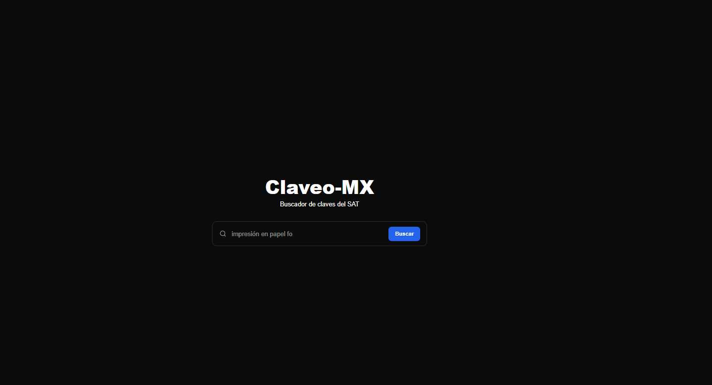

# 🔎 Claveo — Buscador de Claves SAT 🇲🇽

> Una aplicación minimalista y rápida para buscar **claves de productos y servicios SAT** en México.  
> Construida con [Astro](https://astro.build/) + [TailwindCSS](https://tailwindcss.com/).

---

## ✨ Características

- ⚡ **Búsqueda rápida** con ejemplos dinámicos en el placeholder (efecto máquina de escribir).  
- 🎨 **Interfaz limpia y moderna** con TailwindCSS.  
- 🌙 **Modo oscuro por defecto**.  
- 📦 Fácil de extender con panel de sugerencias o autocompletado.  
- 🔧 Código modular: cambia colores desde variables CSS centralizadas.

---

## 📸 Vista previa

---

